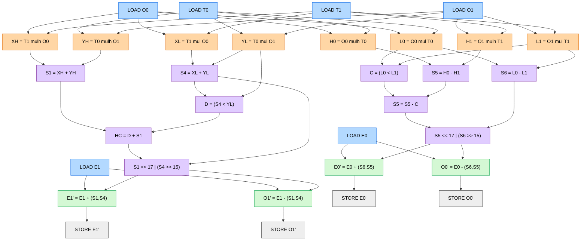

```mermaid

flowchart TD

%% ===========================
%% STYLE DEFINITIONS
%% ===========================
classDef load fill:#b3d9ff,stroke:#1a73e8,stroke-width:1px,color:#000;
classDef mul fill:#ffd6a5,stroke:#e67e22,stroke-width:1px,color:#000;
classDef cmp fill:#e0ccff,stroke:#8e44ad,stroke-width:1px,color:#000;
classDef addsub fill:#d4f8d4,stroke:#27ae60,stroke-width:1px,color:#000;
classDef store fill:#eeeeee,stroke:#555,stroke-width:1px,color:#000;

%% ===========================
%% Load operands
%% ===========================
L_O0["LOAD O0"]:::load
L_T0["LOAD T0"]:::load
L_O1["LOAD O1"]:::load
L_T1["LOAD T1"]:::load
L_E0["LOAD E0"]:::load
L_E1["LOAD E1"]:::load

%% ===========================
%% MUL/MULH
%% ===========================
M_H0["H0 = O0 mulh T0"]:::mul
M_L0["L0 = O0 mul  T0"]:::mul

M_H1["H1 = O1 mulh T1"]:::mul
M_L1["L1 = O1 mul  T1"]:::mul

%% ===========================
%% Compare & corrections
%% ===========================
CMP["C = (L0 < L1)"]:::cmp
S5["S5 = H0 - H1"]:::cmp
S5A["S5 = S5 - C"]:::cmp
S6A["S6 = L0 - L1"]:::cmp

%% ===========================
%% Cross multiplications
%% ===========================
X_H["XH = T1 mulh O0"]:::mul
X_L["XL = T1 mul  O0"]:::mul
Y_L["YL = T0 mul  O1"]:::mul
Y_H["YH = T0 mulh O1"]:::mul

%% ===========================
%% Combine
%% ===========================
S1["S1 = XH + YH"]:::cmp
S4["S4 = XL + YL"]:::cmp
CMP1["D = (S4 < YL)"]:::cmp
HC["HC = D + S1"]:::cmp

%% ===========================
%% Shift & Pack
%% ===========================
SH1["S5 << 17 | (S6 >> 15)"]:::cmp
SH2["S1 << 17 | (S4 >> 15)"]:::cmp

%% ===========================
%% Butterfly Final Add/Sub
%% ===========================
ADD0["E0' = E0 + (S6,S5)"]:::addsub
ADD1["E1' = E1 + (S1,S4)"]:::addsub
SUB0["O0' = E0 - (S6,S5)"]:::addsub
SUB1["O1' = E1 - (S1,S4)"]:::addsub

%% ===========================
%% Store results
%% ===========================
ST0["STORE E0'"]:::store
ST1["STORE E1'"]:::store
ST2["STORE O0'"]:::store
ST3["STORE O1'"]:::store


%% ===========================
%% Edges
%% ===========================

L_O0 --> M_H0 & M_L0 & X_H & X_L
L_T0 --> M_H0 & M_L0 & Y_L & Y_H
L_O1 --> M_H1 & M_L1 & Y_L & Y_H
L_T1 --> M_H1 & M_L1 & X_H & X_L

M_L0 --> CMP
M_L1 --> CMP
CMP --> S5A

M_H0 --> S5
M_H1 --> S5
S5 --> S5A

M_L0 --> S6A
M_L1 --> S6A

X_H --> S1
Y_H --> S1

X_L --> S4
Y_L --> S4
S4 --> CMP1
Y_L --> CMP1

S1 --> HC
CMP1 --> HC

S5A --> SH1
S6A --> SH1
HC --> SH2
S4 --> SH2

L_E0 --> ADD0 & SUB0
L_E1 --> ADD1 & SUB1

SH1 --> ADD0 & SUB0
SH2 --> ADD1 & SUB1

ADD0 --> ST0
ADD1 --> ST1
SUB0 --> ST2
SUB1 --> ST3


```