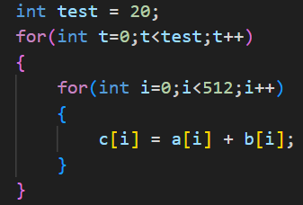
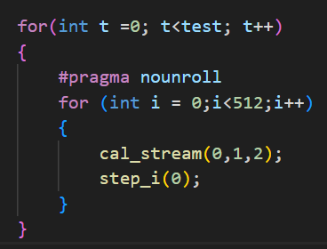

# stream开发整理

## TODO

### 1. 文档说明结果

### 2. 测试
1. outer 20 times 会有bug
2. 整理数据
   
### 3. 开发
1. coding
2. profiling效率
3. 环境更新xx

### 4. 设计

1. **流计算指令**如何获得index：index cnt是一个体系结构状态
   1. 循环变量作为**流计算指令**源操作数
      1. 循环变量i存放在通用寄存器中
      2. 数据相关：通用寄存器相关
      3. 可以处理`部分消耗`
   2. 循环变量不作为**流计算指令**源操作数
      1. 循环变量i存放在硬件寄存器中
      2. 需要额外维护 `step/流计算指令(修改i) -> 流计算指令(使用i)` 的数据相关
         1. TODO对耦合在流水线的方案不友好
            1. 多发射alu
            2. 待发射指令需要检查在流水线中未改变硬件iter cnt的指令
      3. 方案
         1. 使用step指令
            1. 显示递增计数器
            2. 可以处理`部分消耗`
         2. 不使用step指令
            1. 由流计算指令驱动计数器递增
            2. 只能处理`完全消耗`

2. 与流水线耦合
   1. 译码：处理 rj rk rd valid
   2. 重命名：
   3. 发射
      1. 获取 index
      2. 检查buffer对应项是否就绪
   4. 执行
      1. Readop：从buffer/寄存器中对应项取数
      2. 计算
      3. writeback：写buffer/寄存器

3. 流计算指令编码
   1. 扩展custom op
      1. 需要重新为运算指令在custom op之中编码运算(+ - 移位等)
   2. CSR方案()
   

## 5. 路线
1. 确定 与流水线耦合方式  &&  考察重点程序中是否需要`部分消耗`
2. 确定 获得 index 的方式
3. 流计算指令编码

## 数据整理

### 64 word
custom：{Total cycles: 362, Total insts: 287}
normal：{Total cycles: 958, Total insts: 533}

### 512word
custom：{Total cycles: 1832, Total insts: 2080}
normal：{Total cycles: 6844, Total insts: 4120}
加速比 = 3.73

### 512word-20time 
  
normal：{Total cycles: 128770, Total insts: 82077, IPC: 0.637392}
custom：{Total cycles: 33253, Total insts: 41071, IPC: 1.23511}
加速比 = 3.87