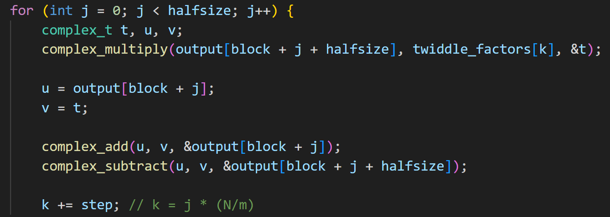
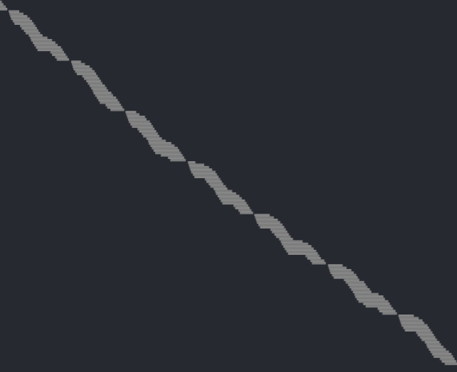
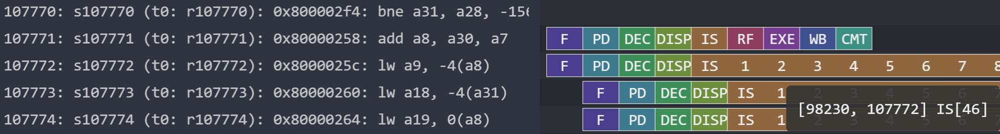
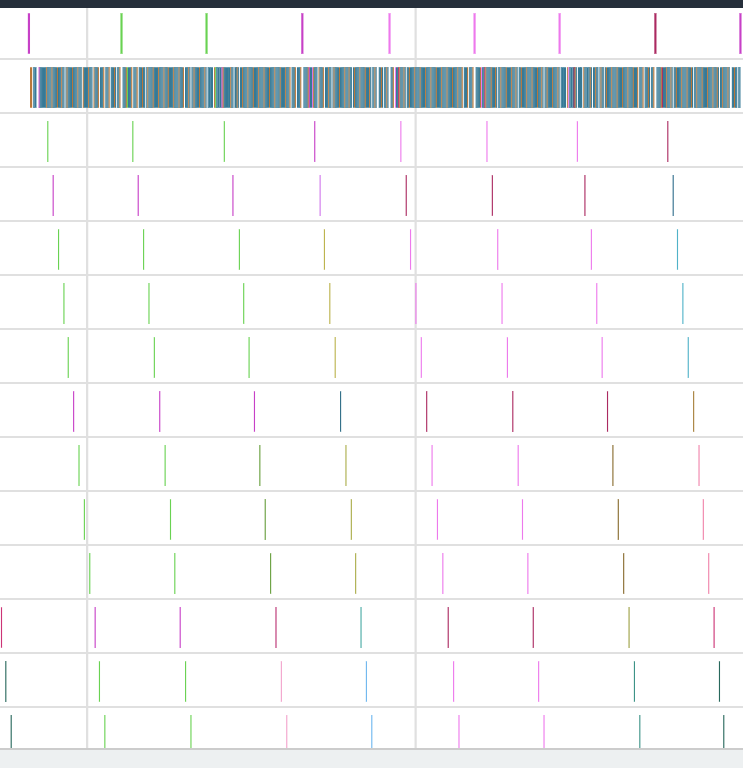
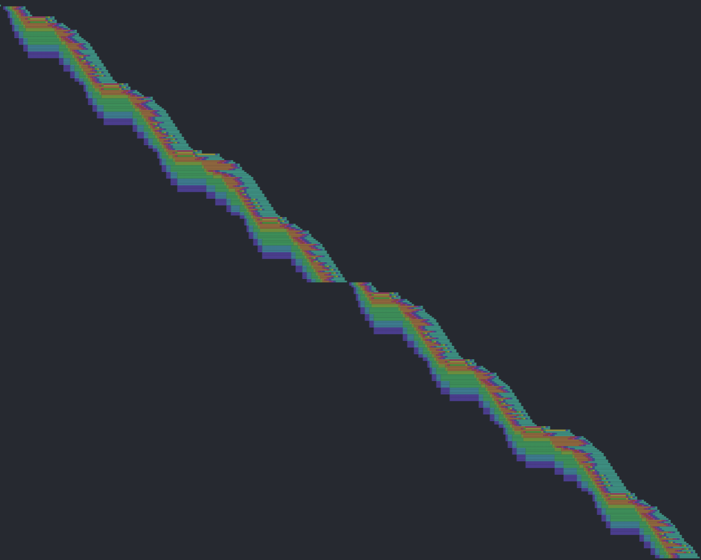
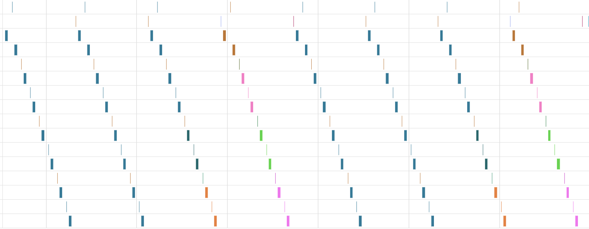
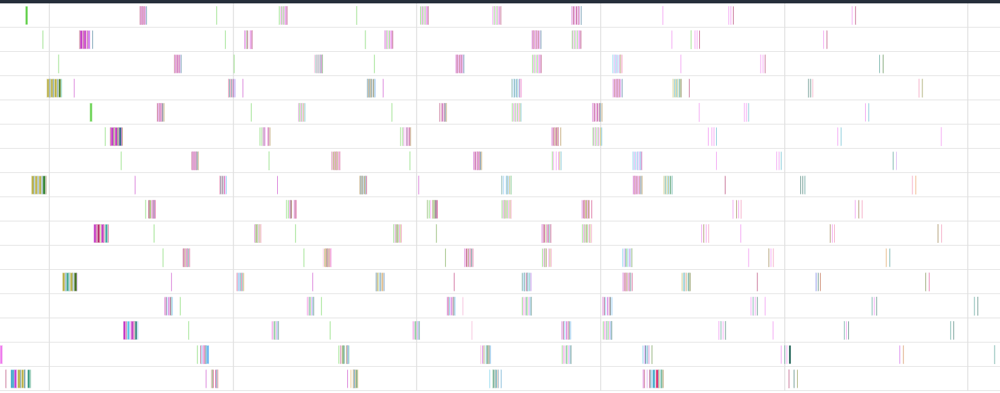

# 结合流水线可视化介绍 FFT FIR Cholesky热点函数

```
l1 cacheline 大小 = 64B，2路组相联，大小=2KB
l2 cacheline 大小 = 128B，4路组相联，大小=16KB
```

## 1. FFT

**执行基本信息**
```
程序的基本块数量: 59
总执行 cycles: 1359971
总指令数: 1369820
总体 IPC: 1.01
```


### 蝶形运算
FFT热点基本块是下面这一段：

该基本块执行了25600次，平均IPC是1.03，执行耗时占总时长%73
说明：
- 运行了 5 次 `fft_1024_point` 函数  
- 外层循环迭代 10 次（对应 log₂1024）  
- 内层每次迭代 512 次  

汇编代码如下：

```C
80000258: 33 04 7f 00  	add	s0, t5, t2
8000025c: 83 24 c4 ff  	lw	s1, -0x4(s0)
80000260: 03 a9 cf ff  	lw	s2, -0x4(t6)
80000264: 83 29 04 00  	lw	s3, 0x0(s0)
80000268: 03 aa 0f 00  	lw	s4, 0x0(t6)
8000026c: b3 1a 99 02  	mulh	s5, s2, s1
80000270: 33 0b 99 02  	mul	s6, s2, s1
80000274: b3 1b 3a 03  	mulh	s7, s4, s3
80000278: 33 0c 3a 03  	mul	s8, s4, s3
8000027c: b3 3c 8b 01  	sltu	s9, s6, s8
80000280: b3 8a 7a 41  	sub	s5, s5, s7
80000284: b3 8a 9a 41  	sub	s5, s5, s9
80000288: 33 0b 8b 41  	sub	s6, s6, s8
8000028c: b3 0b 9a 02  	mul	s7, s4, s1
80000290: b3 14 9a 02  	mulh	s1, s4, s1
80000294: 33 0a 39 03  	mul	s4, s2, s3
80000298: 33 19 39 03  	mulh	s2, s2, s3
8000029c: b3 84 24 01  	add	s1, s1, s2
800002a0: 33 8a 4b 01  	add	s4, s7, s4
800002a4: 33 39 7a 01  	sltu	s2, s4, s7
800002a8: b3 84 24 01  	add	s1, s1, s2
800002ac: 93 9a 1a 01  	slli	s5, s5, 0x11
800002b0: 13 59 fb 00  	srli	s2, s6, 0xf
800002b4: 33 69 59 01  	or	s2, s2, s5
800002b8: 93 94 14 01  	slli	s1, s1, 0x11
800002bc: 83 29 cf ff  	lw	s3, -0x4(t5)
800002c0: 13 5a fa 00  	srli	s4, s4, 0xf
800002c4: 83 2a 0f 00  	lw	s5, 0x0(t5)
800002c8: b3 64 9a 00  	or	s1, s4, s1
800002cc: 33 8a 29 01  	add	s4, s3, s2
800002d0: 23 2e 4f ff  	sw	s4, -0x4(t5)
800002d4: 33 8a 9a 00  	add	s4, s5, s1
800002d8: 23 20 4f 01  	sw	s4, 0x0(t5)
800002dc: 33 89 29 41  	sub	s2, s3, s2
800002e0: 23 2e 24 ff  	sw	s2, -0x4(s0)
800002e4: b3 84 9a 40  	sub	s1, s5, s1
800002e8: 23 20 94 00  	sw	s1, 0x0(s0)
800002ec: b3 8f 5f 00  	add	t6, t6, t0
800002f0: 13 0f 8f 00  	addi	t5, t5, 0x8
800002f4: e3 92 cf f7  	bne	t6, t3, 0x80000258 <.LBB0_15>
800002f8: b3 88 c8 00  	add	a7, a7, a2
800002fc: b3 8e 6e 00  	add	t4, t4, t1
80000300: e3 e8 f8 f4  	bltu	a7, a5, 0x80000250 <.LBB0_14>
```

stage1：输入按顺序取，每隔4次循环l1 miss；一直都用一个蝶形因子，所以只miss1次
正常26.67cycle / iter
l1 miss 会 30 cycle，惩罚  3.33 cycles * 128 time
l2 miss 会 80 cycle，惩罚 53.33 cycles * 6 time(twiddle 1->2 + 未对齐 导致 3)


stage2：

index1 每隔一段时间 会被 2个蝶形因子(0 512) 和output争用


每两次迭代都会misstaken


stage3：

iter2 misstaken-load导致后续load无法发出
+1 ，去取twiddle 1854(实际上是0854 0c54 1054 1454)


4个蝶形因子一起争用 index1，导致非常频繁的miss（应该是每轮迭代都miss twiddle）



每4次迭代都会misstaken
同时这4轮里会有4个twiddle miss和1个output miss


stage4
1/8 misstaken
8 iter ：8twiddle miss(8个蝶形因子争用2个index) + 2 output miss

stage5 1/16

stage6 1/32

后续大概看了下，misstaken应该是逐步减少，然后l2 miss会增多


L2分析
### 基本块11
    for (int i = 0; i < FFT_N; i++) {
        output[i] = input[i];
    }
    可以发现虽然sw过，但是input很显然在l2被其他数据挤出去了
    导致这个片段每隔16个字就会l1 miss，每隔32个字就会l2 miss


### bit-reverse

这一段比较诡异，待分析，总体情况就是后面会少一些miss，大概到最后1/10甚至不miss了
