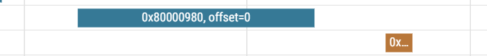

## gemm实现方案

1. A的一行*B的一列=C的一数，B向主存只能按行请求，因此算一个C需要若干行，所以必须要cache来缓存所有行中未使用的列
2. A：stream复用 B：cache复用
3. 过程：
   1. 先取A的一行
   2. 然后取B的若干行到cache
   3. B第一列以流的方式进1个算1个
   4. A row1 和 B col1算好后，说明B的所有行已经取到cache中
   5. 接着是主体
      1. A rowN 与B all col计算
      2. 取 A row_N+1 into stream
4. C output_x的计算细节
   1. 由K个流乘法指令和K个普通累加指令完成，最后写入`通用寄存器`及数组(`cache`)
5. 实现细节
   1. 可以先不实现bypass，这样可以简化SE和L1之间的交互
   2. SE需要维护一个类似 coalescer的玩意儿，把一整个访存请求转换成多个字请求
      1. 实现bypass可能需要比较复杂的自动机

### TODO
1. 写一个仿真环境，difftest
2. itermap配置回环：iter回环起始点，iter回环终止数（这个对于gemm和fft都有实际意义）
3. 先做一个32*16的测试(并对齐地址)，这样L1刚好放得下数组B
   1. 其实b数组的tilestride应该还要再配置一个东西，假设buffer X > gemm_k，应该在gemm_k时来到下一列（目前是直接在buffer X来到下一列）
4. A数组配置可以直接bypass

ITERMAP被改成每个流一个单独的了

---

## 耦合cache测试
1. 
Total cycles: 3382, Total insts: 1571
这个是不对齐版本下的示意图 每次用到的L2-line 前15个数是上一个大iter取出来的，还可以用，后17个数会L2 miss一次，l1miss一次
现在的L2不会连续取了，中间间隔的时间组成：
miss前：A数组一个个读前15个数
触发miss
miss后：l2miss填好自己之后，才能一个一个的向stream发（多了发数周期=15 cycles + l1-miss大概7 cycle）
1. 即使使用bypass，也只能省掉miss后的cycle，miss前的无法省略（除非数组对齐）
2. 引发的思考就是：向cache请求会带来性能损失，因此只有部分需要复用的流才需要向cache请求数据，其他无需复用的流不用

TODO：现在stream.scala里面loadvalid的切换感觉很迷，不过也是对的，先不管了

---

## FFT实现方案

1. 思考点1：奇数偶数流一定要分开
   1. 保持buffer内顺序取数计算的设计原则
   2. 不分开的话，意味着放在一个buffer里，这样无法处理stride超过buffer大小的情况，还不如直接统一
   3. 按stride取数进行reshape本身就是流buffer设计中的关键，由于数据已经缓存在cache里，所以cache足够大的话实际上是向cache请求数据，因此并不会有过多的性能损失

2. TODO思考：
   1. sw要不要搞个流，让它直接去dram
   2. twiddle咋整

3. Turkey
   1. stage1
      1. ITER 0（0-15） 13579 11 13 15   
         1. 奇流问 cache，cache miss，AXI bypass stream（0-15点进入L2 0-7进入L1）
         2. 偶流问 cache，后半段 cache miss，L2 bypass stream
      2. ITER 1 (16-31) 

### 方案一：只分配 奇偶 流，大小各 2*X，用于stage loadStore-loadStore级别的 pingpong-buffer （X在目前的配置是32字 16点，可以完成32点FFT）
load一半点数到奇数流
load另一半到偶数流
do it 
存数到奇偶流的另一半区
用另一半区算，再存另一半区
1 3 5 7 
2 4 6 8

1 2 5 6
3 4 7 8

**存数的时候reshape**
取数计算的时候就是顺序索引
但是存buffer的时候复杂度大大增加

**优势**
可以借助stream buffer灵活reshape（但感觉不算优势，因为这个实现比较繁琐）
除了第一个stage，后续的所有stage都不与cache纠缠

**劣势**
1. 违背了流buffer 不复用存数的初心，存数要复用就该用cache
2. 一点都不通用，像是专门为fft设计的方案
3. load-store耦合在一起，和原来的设计差别太大
4. 另外，我们的风格是取数的时候进行reshape，如果这个数据是从cache中取的，那么便不会有性能损失
5. 只能算极小点数的FFT

### 方案二：分配 奇偶流，大小各 2*X，用于stage load-load级别（L1支持256点 L2支持1024点）

load一半点数到奇数流
load另一半到偶数流
do it（内循环）
存数到cache
load一半点数到奇数流
用另一半区算，再存另一半区

...换stage
更新取数stride

1. 这里需要考虑一个问题：stage间的数据存在复用，而我们的buffer取数是预取，那么是否会存在数据相关，导致预取的时候应有的数据还没在cache里
答案是点数≥128 就不会(64点=16点*2*2，在最后两个stage刚好出现问题)
小于这个点数的话，其实原来CPU的cache是够装的，流式访存提示有限 

**优势**
1. 很符合原来的设计思路：load时reshape，同时借助cache复用（各stage间复用，奇偶流在没跨cacheline时候（小stage）的复用）
2. stream buffer起到一个reshape，预取的作用（预取的窗口是很大的，所以就算数据不在cache里也没问题）
