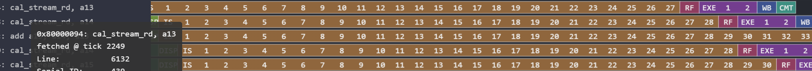

1. 12/24：让LSPP的访存请求优先于SE的请求，IPC从0.73增到1（因为LSPP的指令被阻塞会导致ROB满，后续指令无法发出）
   1. TODO：奇怪的点是cache-trace到的l1-miss多了很多，先不管吧
2. 12/30：MNK32下，由于L1只能装512个数，这是完全装不下B的，B数组每次都要去L2请求，这是极大的开销，IPC很低，所以直接改成L2最好

## 0104-0105：   

gemm MNK32 32bit O3优化 

### 普通矩阵乘过程：
1. 首先软件进行转置操作（blk3），cycles=11604，IPC=0.19，迭代32次(对应32行)，完成的操作是srcB -> destBT，最终destBT会以row-major的形式在L2中。IPC低有两个原因：
   1. **iter1**的耗时是2087，因为取srcB的第一列时，相当于取整个srcB(32个L2-cacheline)，因此发生了32次L2 miss
   2. 后续iter(列)的转置基本是没有L2 miss的（少量miss的原因可能是srcB和destB在L2发生冲突缺失），但是因为L1容量不足，所以lw srcB某列的每个数时，都会l1 miss
2. 完成转置之后，此时L2里应该被B和BT完全占据，L1大概是被右半边的B占据
3. 接下来是展开的gemm过程：

   

   图片下方blk6（内层循环体）的一个迭代完成的是C数组一个element的计算，也就是说循环展开了32次（按K展开），blk6循环32次（C的一行）会对应一个blk5的执行，blk5 会把A的部分数据放到寄存器以便复用，这样在内层循环体中就可以少lw一些A

   1. blk6：总cycles=91062，迭代次数 1024，IPC=1.25，低IPC是因为B数组在L1装不下，所以每次都会L1 miss
   2. blk5: 总cycles=6635, 迭代次数 32, IPC=0.26，低IPC是因为A数组的 冷不命中 L2-miss

### STREAM-GEMM过程：

核心循环体是blk3，总共执行44361 cycles，迭代1024次
> A数组直连AXI取数
> B数组直连L2取数
1. blk3的iter1执行耗时是1680cycles。在iter1开始前，A的前两行已经来到stream buffer（配置好就可以取，预取）。对于B，stream engine会向L2发送32个取数地址，**push L2把整个B load(32个cacheline)** 到L2中，同时把stream engine需要的数据返回。在iter1执行过程中，L2逐渐装载整个B，而B的一列来到stream buffer就会被乘法指令消耗掉
2. 后续的iter，stream engine会向L2流水地发送B的数据请求，因为L2里有整个B，所以每次都会命中，在流水的情况下可以认为每一拍都可以得到1个B的数据。又因为计算的速度跟不上访存，因此取B实际上会领先于B的消耗
3. 当32个iter执行过后，A的第三行可以提前load，达到预取的效果
4. 受C数组L2按写分配的影响，大概每32次迭代就会有一次C的L2 miss，这个miss会占用L2，推迟B数组 的提前load，例如：
   
   

   第五iter末尾的sw不会影响iter6（因为b的数取回速度是大于消耗速度的），但是到iter7还没sw好，因此对iter7还没得到数的指令有些许影响，大概21 cycles左右
      
   

### 核心结论：
44361 vs 109301，节省了64940 cycles，加速比≈2.46倍

核心循环体1024次迭代(43 vs 88  cycles / iteration)

1. stream buffer直接作为计算指令源操作数，节省了**大量的lw指令与lw->mul延迟**：
   1. stream实现版本循环体内部66insts，普通版本111insts，少了44条lw指令(还有一条其他指令)
   2. 普通实现版本中blk5的耗时(blk5提前把部分A的数据load到寄存器中)
2. 节省了**转置浪费**的 ≈10000 cycles，原因是软件转置有大量的lw sw指令以及L1 miss，stream转置是由异步发起的地址请求完成的，而不是由指令驱动。此外，stream转置是**穿插在计算过程中**的，并不是两个全数组的lw-modify-sw，而是按列的粒度进行
   1. BTW，转置在L2够大，L1不够容纳一个B的时候应该是纯没用的
3. 通过**直连L2**，节省了核心循环体B数组L1 miss的时间，≈8000cycles：普通流水线要走L1来取B，而L1不够容纳B，所以每个新line都会容量miss；而我们直接走的L2->stream buffer
4. 通过**预取**，节省了A数组的L2冷缺失，≈1200 cycles

